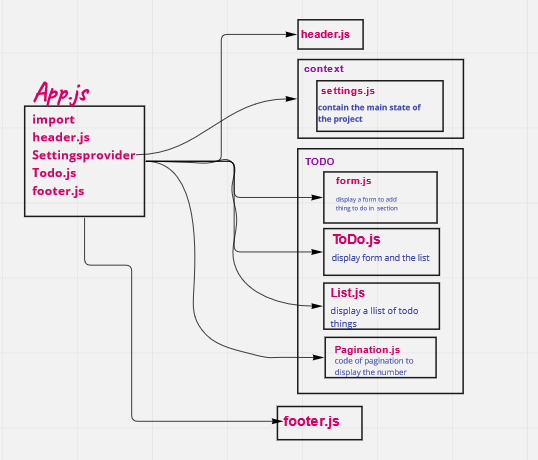

# todo-app

# To Do List Manager

  *  A Web Application for securely managing a To Do List

[PR link](https://github.com/salammustafa728/todo-app/pull/1)

[Deploy Link](https://todo-app-salam.netlify.app/)

# Phase 2: 
* Implement the Context API to make some basic application settings available to components 

* Provide the users with a form where they can change the values for those settings 

[PR link2](https://github.com/salammustafa728/todo-app/pull/3)

# phase 3: ` <Login /> and <Auth /> `

make the users be logged in, in order to see the to do items. Additionally, based on their user type, they will be allowed (or denied) to perform actions such as editing or deleting them.

for login try=>

* admin: admin and 123
* user: user and 123

[PR link](https://github.com/salammustafa728/todo-app/pull/6)

# Uml

